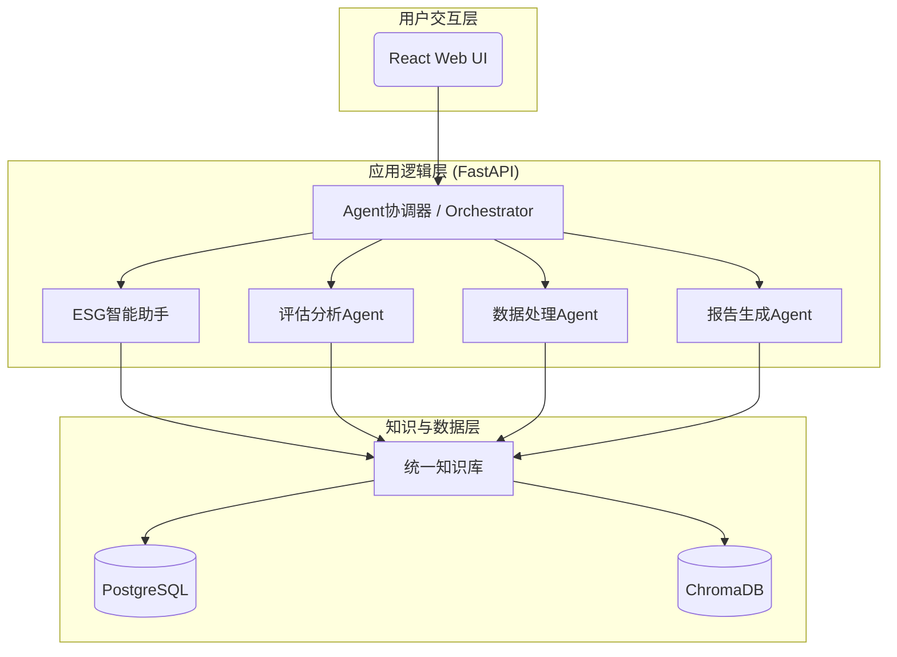

# System Patterns: ESG-Copilot

本文档记录了ESG-Copilot系统的核心架构设计、设计模式和关键技术决策。

## 1. 核心架构：协作式Agent集群

系统没有采用传统的单体或微服务架构，而是构建在一个**协作式Agent集群**之上。

- **Agent协调器 (Orchestrator)**: 作为所有请求的入口，负责理解用户意图、将任务分解并委派给最合适的专业Agent。
- **专业Agent集群**: 四个核心Agent（智能助手、评估、数据处理、报告）各自拥有独立的"角色"、"能力"和"工具"，专注于特定领域。它们之间通过A2A（Agent-to-Agent）协议进行通信，协同完成复杂任务。
- **统一知识库**: 所有Agent共享一个统一的知识库，确保了决策依据的一致性和专业性。该知识库是关系型数据和向量化非结构化数据的结合体。

## 2. 知识库架构模式

知识库采用了**混合存储与混合搜索**的模式。

- **存储模式**:
    - **PostgreSQL**: 存储结构化数据，如用户信息、企业档案、评估结果、历史数据等。
    - **ChromaDB**: 存储非结构化文档（如PDF, Word）经过分块和向量化后的Embedding向量及元数据。
- **搜索模式 (RAG - Retrieval-Augmented Generation)**:
    1.  **混合搜索**: 用户查询会同时触发关键词搜索（在PostgreSQL元数据中）和向量相似度搜索（在ChromaDB中）。
    2.  **Re-rank (预留)**: 初步检索结果会经过一个预留的Re-rank接口进行重新排序，以提高最终上下文的质量。
    3.  **上下文增强生成**: 经过排序的高度相关的知识片段，与用户原始问题一起，被送入LLM生成最终答案。

## 3. 关键技术决策

- **本地化优先**: 系统的核心组件，特别是知识库（包括向量数据库），被设计为可本地化部署。这解决了企业对于数据隐私和安全的核心关切。
- **API Embedding**: 采用与OpenAI兼容的API标准，允许用户灵活选择不同的Embedding服务（如OpenAI或成本更低的国产模型），而不是锁定在单一供应商。
- **异步处理**: 后端服务（FastAPI）和数据库交互（SQLAlchemy）全面采用`async/await`，以确保在高I/O负载（如与LLM API通信）下的系统性能和响应能力。 