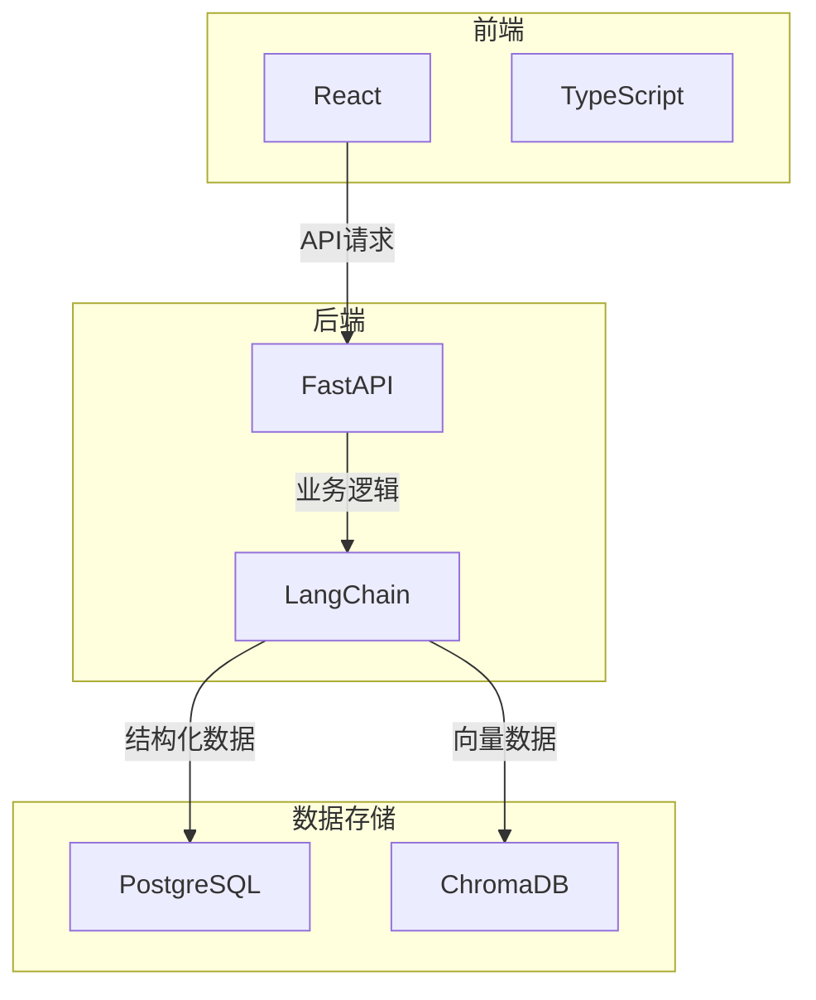

# Tech Context: ESG-Copilot

本文档概述了ESG-Copilot项目所采用的核心技术栈、开发环境配置和关键依赖。

## 1. 核心技术栈

| 类别       | 技术/框架         | 备注                               |
| :--------- | :---------------- | :--------------------------------- |
| **Agent框架** | LangChain         | 提供Agent、Chain和Tool的基础架构。   |
| **后端服务** | Python, FastAPI   | 构建异步API服务，作为Agent的宿主环境。 |
| **前端界面** | React, TypeScript | 构建响应式的Web用户界面。            |
| **状态管理** | Zustand / Redux   | 管理前端的全局状态。               |
| **关系型数据库** | PostgreSQL        | 存储结构化数据。                   |
| **向量数据库** | ChromaDB          | 轻量级、可本地部署的向量存储方案。     |
| **容器化** | Docker            | 用于开发环境和最终部署。           |

## 2. 开发环境与设置

- **Python版本**: 3.10+
- **Node.js版本**: 18.x (LTS)
- **包管理**:
    - 后端: `Poetry` 或 `pip` + `requirements.txt`
    - 前端: `pnpm` 或 `npm`
- **代码规范与格式化**:
    - Python: `Ruff` / `Black` (格式化), `Mypy` (类型检查)
    - TypeScript: `Prettier` (格式化), `ESLint` (代码检查)
- **运行开发环境**:
    - 推荐使用 `docker-compose up` 来一键启动所有服务（FastAPI, React, PostgreSQL, ChromaDB）。
    - 或者，可以分别在前后端目录运行 `uvicorn` 和 `npm run dev`。

## 3. 关键依赖与服务

- **LLM API**: 系统需要一个与OpenAI API兼容的语言模型服务接口。
- **Embedding API**: 系统需要一个与OpenAI API兼容的文本嵌入模型服务接口。
- **文档解析**:
    - `pypdf` / `python-docx`: 用于解析PDF和Word文档。
    - `unstructured`: 用于处理更复杂的非结构化数据。
- **数据库驱动**:
    - `psycopg2-binary` 或 `asyncpg`: 用于连接PostgreSQL。
    - `SQLAlchemy`: ORM框架，配合Alembic进行数据库迁移。

## 4. 技术限制与约束

- **MVP阶段**:
    - **向量数据库**: 选择ChromaDB是为了快速启动和本地化部署，当数据量和并发量增大时，可能需要迁移到更专业的方案（如Milvus, Weaviate）。
    - **Re-rank**: MVP阶段预留了Re-rank接口，但未实现。初期的搜索相关性完全依赖于Embedding模型和向量搜索。
- **网络**: Agent的性能高度依赖于与LLM/Embedding API服务的网络延迟。 